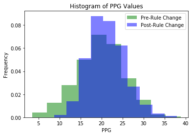

# NFL Scoring Before and After the Defensive Holding Rule is Implemented 

# Purpose

The goal of this project is to identify how the introduction of defensive holding as a penalty effected scoring in the NFL. I am going to compare two samples of data. The first sample will be from before the introduction of the pass interference rule in 1977, or 1935-1977, and after the rule was implemented 1977-2020. 

# Hypothesis

The null hypothesis is that the mean of league-wide scoring in the NFL is not significantly different after the implementation of the defensive holding rule than before.

H0: 𝜇0 (19.71) = 𝜇A (21.24)

The alternative hypothesis is that the mean of league-wide scoring in the NFL is significantly different after the implementation of the defensive holding rule than before.

HA: 𝜇0 (19.71) ≠ 𝜇A (21.24)

# Data Preparation

The data for the project was sourced from pro-football reference with an API developed by Ben Kite. The API did an excellent job of extracting the data from the website tables in a useable format, and from there I wrote a for loop that dynamically pulled the table information and saved to csv based on the year the season occured.

Source Links:

Data:
https://www.pro-football-reference.com/

API:
https://github.com/BenKite/football_data/blob/master/profootballReferenceScrape.py

# EDA

Important Summary Statistics:
Pre-rule change has a sample size of 625, a mean of 19.71, and a standard deviation of 5.64.
Post-rule change has a sample size of 1297, a mean of 21.24, and a standard deviation of 4.33.

Graphs:

I wanted to explore the league average points per game scored over time. It starts out low and picks up as time goes on. It is interesting to note that around 1950 PPG peaks and then those levels of scoring aren't seen again until after 2010. Each data point on the y-axis is the league average of ppg scored in that year. 

I also wanted to plot the samples in a histogram to gain some insight into the distributions before I proceeded with my hypothesis testing. There is some overlap, but there is also data from both samples that is outside the other distribution. 

# Hypothesis Testing

I chose to use the Welch Ttest for my hypothesis testing. I am making an assumption that the sample means come from a normal distribution, and that the sample sizes are sufficient to adhere to central limit theorum. It is also important to mention that because the sample data post-rule change has a greater sample size I cannot use the standard ttest and have to use Welch's adjustment in order to compensate for the difference in sample sizes.

It is important to also note that I calculated a statistical power of 0.99, which is more than suffiencient to proceed with.

The Welch Ttest returned a pvalue of 3.22*10^-9 (0.00000000322). 

# Conclusion

With a p-value of 3.22*10^-9 and at a significance level of 0.05 I reject the null hypothesis that the sample means are not significantly different. This means that scoring did in fact was different after the rule change. In terms of how practical this information is it's important to consider that when sample sizes are large that it is easier to reject the null hypothesis.That being said if it is proven that the mean difference from the rule change generates a meaningful result then it can be practical.  